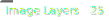

[](https://microbadger.com/images/themetabay/plex "Get your own image badge on microbadger.com")  [](https://hub.docker.com/r/themetabay/plex/)  [](https://hub.docker.com/r/themetabay/plex/) 


# Information:
More information can be found here: https://github.com/plexinc/pms-docker

This fork expands on the healthcheck for verifying media folders are mounted, more to come.

# Requirements
- The healthcheck file should exist somewhere in the /data folder with your media files and be present only when your media folders are mounted correctly. Docker will be checking to see that the file exists and mark Plex as Unhealthy when your media is missing.

# Run example:
```
docker run -d \
  --name plex \
  --network=host \
  --cap-add SYS_ADMIN \
  --privileged \
  --restart unless-stopped \
  -e TZ="<timezone>" \
  -e PLEX_CLAIM="<claimToken>" \
  -e HEALTHCHECK_FILE="/data/healthcheck.file" \
  --volume plex.config:/config  \
  -v plex.transcode:/transcode \
  -v /mnt/rclone:/data:shared  \
  themetabay/plex:latest
```

An example timezone is America/New_York. Note the underscore _ in New York. 
